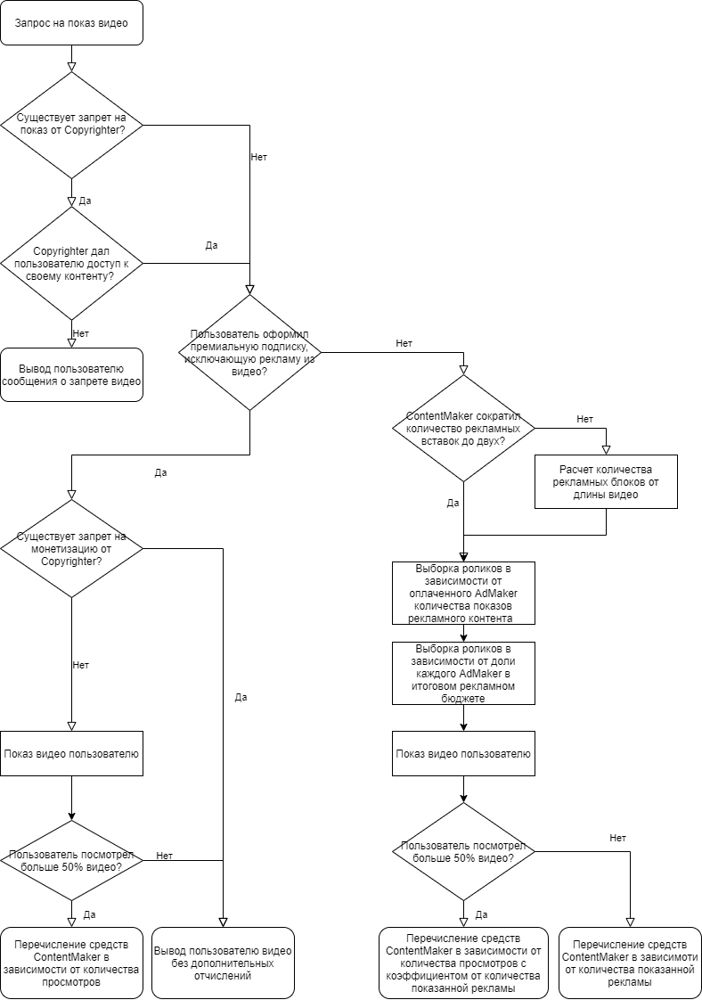

Основные сущности:

• AdMaker – актер, производящий рекламу и платящий за возможность и частоту ее показа на хостинге. От внесенной суммы в данном месяце и ее отношения к общему рекламному бюджету будет определяться частота показа рекламного ролика каждого объекта. Может оплатить строго заданное количество показов рекламного контента в рамках месяца.

• Copyrighter – актер, обладающий авторским правом на определенный контент. Может запросить снятие монетизации либо полный запрет видео, содержащего его контент, дать пользователю временный или неограниченный по времени доступ к своему контенту за соответствующую плату.

• ContentMaker – актер, производящий содержимое хостинга. Может сократить количество рекламных вставок до двух (в начале и в конце видео) в своем контенте. Может подвергаться запретам со стороны Copyrighter. При оформлении договора на показ рекламы, имеет доход с каждого показанного ролика. Имеет безусловный доход, за исключением запрета монетизации, за каждый просмотр своего видео более чем на 50%.

• User   –   актер, потребляющий содержимое хостинга. Может оформить премиальную подписку, исключающую рекламу из видео.

